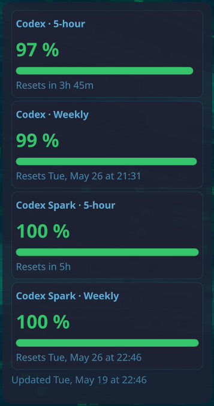

# AI Usage Widget

KDE Plasma 6 widget for showing local AI usage balance. The current provider is ChatGPT/Codex: it displays the same kind of remaining usage windows shown on the ChatGPT Codex usage/balance page, including Standard and model-specific limits when the backend returns them.



> [!WARNING]
> This project uses ChatGPT/Codex's internal `https://chatgpt.com/backend-api/wham/usage` endpoint. It is not an official public OpenAI API and may change or break without notice.

## Requirements

- KDE Plasma 6
- Python 3
- `kpackagetool6`
- One authenticated local auth source:
  - official Codex CLI auth at `~/.codex/auth.json` preferred
  - Pi auth at `~/.pi/agent/auth.json` as fallback

To create Codex CLI auth, install Codex and run:

```bash
codex login
```

## Install

```bash
git clone https://github.com/gebba/ai-usage-widget.git
cd ai-usage-widget
./install.sh
```

The installer:

1. copies the helper to `~/.local/lib/ai-usage-widget/codex_usage.py`
2. creates `~/.local/bin/ai-usage-widget-helper`
3. installs or upgrades the Plasma widget
4. runs the helper once to prime the cache

Installed paths:

```text
~/.local/share/plasma/plasmoids/io.github.gebba.ai-usage-widget/
~/.local/lib/ai-usage-widget/codex_usage.py
~/.local/bin/ai-usage-widget-helper -> ~/.local/lib/ai-usage-widget/codex_usage.py
```

After installing, add **AI Usage Widget** from Plasma's widget picker. If an already-added widget still uses stale QML after upgrading, restart Plasma Shell:

```bash
systemctl --user restart plasma-plasmashell.service
```

## Uninstall

```bash
./uninstall.sh
```

This removes the Plasma widget, installed helper, helper symlink, and local cache.

Keep cache while uninstalling:

```bash
./uninstall.sh --keep-cache
```

## How it works

```text
~/.codex/auth.json or ~/.pi/agent/auth.json
  -> ~/.local/lib/ai-usage-widget/codex_usage.py
  -> ~/.local/state/ai-usage-widget/state.json
  -> ~/.local/state/ai-usage-widget/state-cache.qml
  -> Plasma QML widget
```

Auth lookup order:

1. `--auth-file`, if passed to the helper
2. `AI_USAGE_AUTH_FILE`, if set
3. `~/.codex/auth.json` from the official Codex CLI
4. `~/.pi/agent/auth.json` from Pi

An explicit `--auth-file` or `AI_USAGE_AUTH_FILE` is treated as an override; if that file is missing or invalid, the helper reports an error instead of silently falling back.

The widget itself does **not** read raw auth files. It reads only the sanitized cache:

```text
~/.local/state/ai-usage-widget/state-cache.qml
```

`state.json` is kept for debugging/human inspection.

## Configuration

Open the widget settings from Plasma:

1. Right-click **AI Usage Widget**.
2. Choose **Configure AI Usage Widget…**.

Available options:

- **Auto-refresh every 10 minutes** — runs the installed helper while the widget is loaded.
- **Hide Codex Spark usage** — hides the Codex Spark-specific cards and shows only the main Codex limits.
- **Refresh now** — manually runs the helper and updates the cache.

The settings page also shows the current cache source and installed helper path for debugging.

## Refresh behavior

The widget settings page has a **Refresh now** button. It runs the installed helper directly, updates the cache, then reloads the display.

When **Auto-refresh every 10 minutes** is enabled, the widget runs the helper every 10 minutes while the widget is loaded.

Independently, the widget reloads the local cache every 30 seconds, so external/manual helper runs appear automatically.

## Manual helper usage

Installed helper:

```bash
~/.local/bin/ai-usage-widget-helper --print
```

Project helper during development:

```bash
./helper/codex_usage.py --print
```

Use a specific auth file:

```bash
~/.local/bin/ai-usage-widget-helper --auth-file ~/.codex/auth.json --print
~/.local/bin/ai-usage-widget-helper --auth-file ~/.pi/agent/auth.json --print
```

Or via env var:

```bash
AI_USAGE_AUTH_FILE=/path/to/auth.json ~/.local/bin/ai-usage-widget-helper --print
```

## Visual behavior

The widget shows remaining percentage, not used percentage:

```text
remainingPercent = 100 - used_percent
```

Color thresholds:

- green: `>= 75%` remaining
- yellow: `25–74%` remaining
- red: `< 25%` remaining

Reset labels:

- 5-hour limits: relative time, e.g. `Resets in 2h 31m`
- weekly limits: day/date/time, e.g. `Resets Sat, May 23 at 23:46`

## Troubleshooting

### Widget says no source / never updated

Check that the cache exists:

```bash
ls -l ~/.local/state/ai-usage-widget/state.json ~/.local/state/ai-usage-widget/state-cache.qml
```

Run the installed helper manually:

```bash
~/.local/bin/ai-usage-widget-helper --print
```

### No auth found

Install/authenticate Codex CLI:

```bash
codex login
```

Then run:

```bash
~/.local/bin/ai-usage-widget-helper --print
```

Alternatively, authenticate Pi so `~/.pi/agent/auth.json` contains an `openai-codex` entry.

### Auth expired or denied

If the helper reports HTTP 401 or HTTP 403, re-authenticate Codex/Pi and refresh again:

```bash
codex login
~/.local/bin/ai-usage-widget-helper --print
```

### Helper missing

The widget expects the helper here:

```text
~/.local/lib/ai-usage-widget/codex_usage.py
```

Run:

```bash
./install.sh
```

## Possible future directions

These are ideas, not promises or a roadmap:

- Additional providers such as GitHub Copilot, Anthropic, and OpenRouter.
- Rolling cost tracking where provider APIs expose spend or token usage.
- Provider-specific quota/limit cards alongside cost cards.
- A more generic provider/plugin layout for the helper.
- Configurable refresh intervals and provider selection in the widget settings.

Support depends on what each provider exposes locally or through stable APIs. Some providers may not expose reliable quota, usage, or cost data suitable for a desktop widget.

## Development workflow

After editing QML/helper files, reinstall with:

```bash
./install.sh
```

For QML-only changes this also upgrades the installed plasmoid. For helper changes it also copies the helper to `~/.local/lib/ai-usage-widget/`.

If Plasma caches stale code:

```bash
systemctl --user restart plasma-plasmashell.service
```

## Security notes

- Raw Codex/Pi auth is read only by the installed helper, not by the QML widget.
- The helper writes sanitized local cache files with `0600` permissions.
- The cache does not include access tokens, refresh tokens, bearer tokens, email, or account ID.
- Do not commit `~/.codex/auth.json`, `~/.pi/agent/auth.json`, or copied auth/token files.

## License

GPL-3.0-or-later. See [LICENSE](LICENSE).
